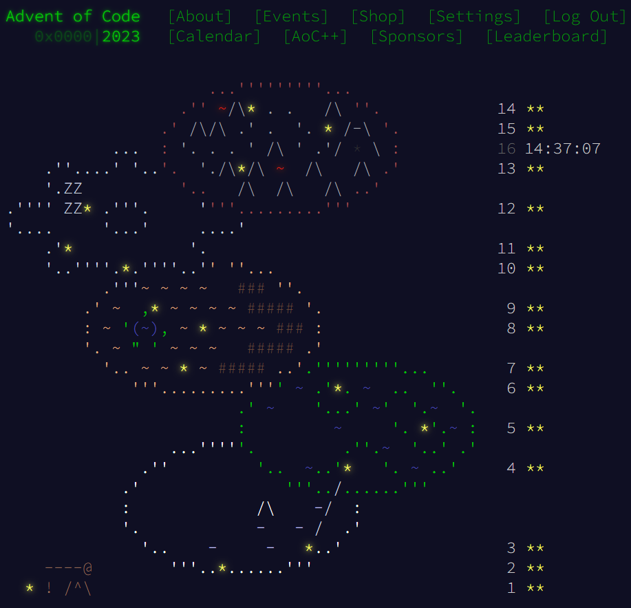

# aoc23
Advent of Code 2023 in C++
## Introduction
My goal for this year is to provide tests (using puzzle samples) and try to practice modern C++ language and library features wherever possible
## Computation times (no optimizations, both parts run separately and parse the input file).
Processor: Intel(R) Core(TM) i7-12700H, single thread unless indicated

Day | Part One [ms] | Part Two [ms]
--- | ---: | ---:
Day 1: Trebuchet?! | 0.798 | 3.455
Day 2: Cube Conundrum | 1.218 | 1.044
Day 3: Gear Ratios | 0.508 | 0.430
Day 4: Scratchcards | 1.411 | 1.299
Day 5: If You Give A Seed A Fertilizer | 0.428 | 40077.673
Day 6: Wait For It | 0.112 | 0.090
Day 7: Camel Cards | 1.139 | 1.165
Day 8: Haunted Wasteland | 32.278 | 432.601
Day 9: Mirage Maintenance | 2.415 | 2.123
Day 10: Pipe Maze | 4.265 | 3.708
Day 11: Cosmic Expansion | 48.528 | 50.491
Day 12: Hot Springs | 24.397 | 704.949
Day 13: Point of Incidence | 0.412 | 0.421
Day 14: Parabolic Reflector Dish | 0.185 | 94.235
Day 15: Lens Library | 0.560 | 1.912

Total time: 41.494 seconds (41494.249 ms)

## Calendar at 30 stars

